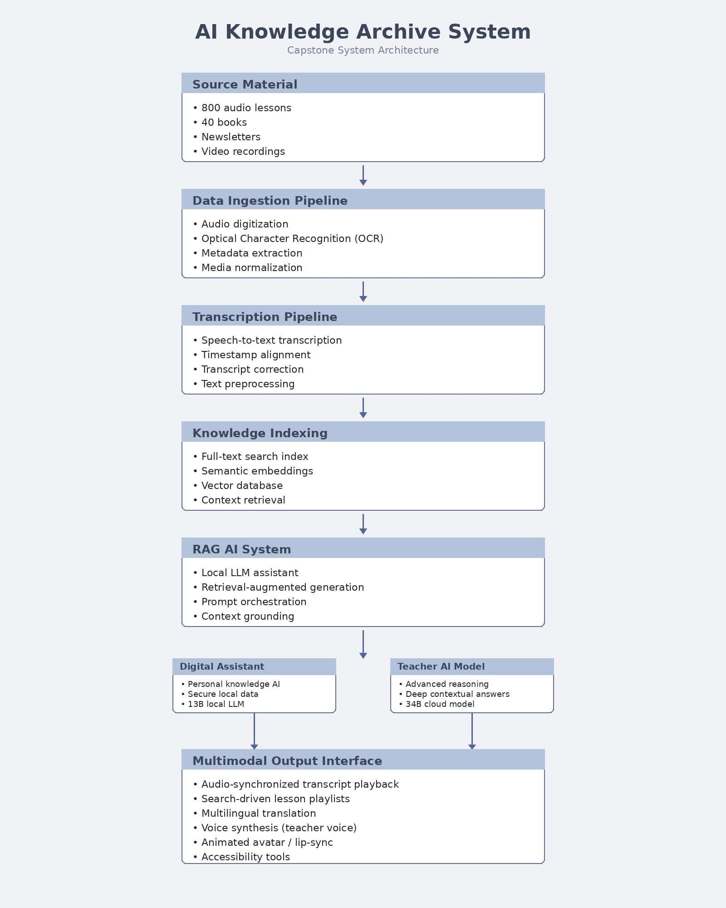
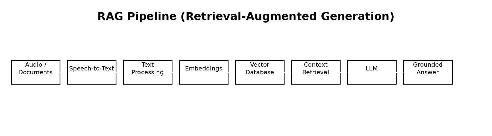

# AI Knowledge Archive

Building an AI-assisted knowledge archive that converts large collections of recorded lectures and books into a searchable platform using speech transcription, semantic embeddings, vector databases, and retrieval-augmented generation (RAG).

**Core technologies:** speech-to-text • semantic embeddings • vector databases • LLM knowledge retrieval • multimodal AI interface

## Project Overview

This project builds an AI-assisted archival system capable of converting audio recordings and written materials into a searchable knowledge interface.

The system integrates modern AI technologies to enable users to search, navigate, and interact with archived teachings through natural language queries.

The platform is designed to support:

• large audio archives  
• searchable transcripts  
• semantic knowledge retrieval  
• AI-assisted question answering  
• multilingual accessibility  

The system emphasizes privacy-first architecture with the ability to run core AI models locally.

Capstone project: AI system for transforming large audio archives into searchable knowledge interfaces.

## System Architecture

## AI Retrieval Pipeline (RAG)

## Key Capabilities

• Automatic speech transcription of archived recordings  
• Timestamp-aligned transcripts for audio navigation  
• Full-text and semantic search across archive content  
• AI-powered question answering grounded in source material  
• Multilingual translation and accessibility support  
• Voice synthesis and avatar-based interaction  

## Technology Stack (Planned)

Python  
Speech-to-text models  
Vector databases  
Retrieval-Augmented Generation (RAG) frameworks  
Local LLM deployment  
Web-based search interface  

## Repository Structure

- `architecture/` — system diagrams and design documentation  
- `data-pipeline/` — ingestion and media preparation workflows  
- `transcription/` — speech-to-text and transcript alignment workflows  
- `rag-system/` — semantic retrieval and LLM orchestration components  
- `interface/` — user-facing search, playback, and multimodal interaction layer  
- `docs/` — project documentation, diagrams, and planning materials  

## Project Status

Architecture and research phase.

This repository documents the development of an AI-powered knowledge retrieval system designed for large archival collections.
